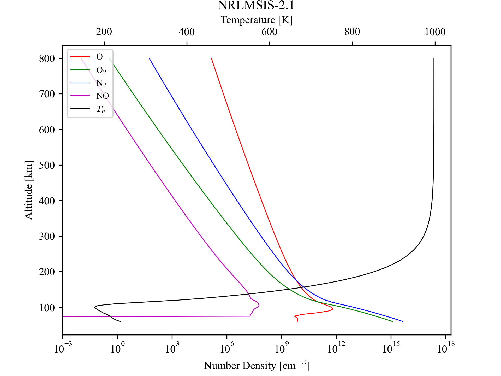

[](https://zenodo.org/badge/latestdoi/1090668363)
# NRLMSIS-2.1 Python Wrapper
`msis21py` is a wrapper around the [NRLMSIS-2.1](https://ccmc.gsfc.nasa.gov/models/NRLMSIS~2.1/) empirical model.

This repository uses the [NRLMSIS-2.1 model](https://map.nrl.navy.mil/map/pub/nrl/NRLMSIS/NRLMSIS2.1/nrlmsis2.1.tar.gz) as is with Python. 
The integration is achieved by means of a FORTRAN shim ([`msis21shim.f90`](src/msis21fort/msis21shim.f90))
that is compiled into a module using [F2PY](https://numpy.org/doc/stable/f2py/index.html). The parameter file `msis21.parm` is automatically
provided at runtime.

## Installation
A Fortran compiler is *REQUIRED* to build the FORTRAN extension module.
### From [PyPI](https://pypi.org/project/msis21py/)
```sh
pip install msis21py
```
### From [GitHub](https://github.com/sunipkm/msis21py)
```sh
pip install msis21py@git+https://github.com/sunipkm/msis21py
```

## Usage
```py
from msis21py import NrlMsis21, alt_grid
from datetime import datetime, UTC
import matplotlib.pyplot as plt

# Instantiate the model
msis = NrlMsis21()
# Note: msis is a singleton (thread safety with FORTRAN)
# Evaluate the model
ds = msis.evaluate(
    datetime(2022, 3, 12, 0, 0, 0, tzinfo=UTC),
    40, -70,
    alt_grid()
)

# ds is an xarray Dataset
# Plot neutral temperature profile
ds.Tn.plot(y='alt_km')
plt.show()
```

## Output Dataset Format
- Coordinates
  - Altitude (`alt_km`): Altitude in *km*
- Data Variables (as a function of altitude)
  - Densities of O, O<sub>2</sub>, N<sub>2</sub>, H, He, Ar, N, Anomalous O, and NO in *cm*<sup>-3</sup>
  - Neutral temperature (`Tn`) in *K*
  - Mass density (`mden`) in *g cm*<sup>-3</sup>
- Attributes
  - `settings`: JSON string of settings (`msis21py.Settings`) used to evaluate the model.
  - `date`: ISO formatted date and time for which the model was evaluated.
  - `lat` and `lon`: Latitude and longitude for where the model was evaluated.
  - Additional attributes are provided as JSON dictionaries containing a `value`, its `unit`, a longer name (`long_name`) and an associated `description`, if available.

The dataset is NetCDF4 compatible.

## Examples
An example script to generate the following plot is available in the in [`tests/test_msis21.py`](tests/test_msis21.py).


# License
This project is licensed under the MIT License. See the [LICENSE](LICENSE) file for details.
The NRLMSIS-2.1 model is in the public domain as per the [original license](nrlmsis2.1_license.txt), and is a product of the U.S. Government that is restricted to academic and research use only. Please refer to the original license for more details.
Please follow the citation guidelines provided by NRL when using the model in your work.

# Citation
If you use this code in your work, please cite the repository:
```bibtex
@software{sunipkm_msis21py_2025,
  author       = {Sunip K. Mukherjee},
  title        = {{msis21py}: A Python Wrapper for the NRLMSIS-2.1 Empirical Model},
  month        = nov,
  year         = 2025,
  publisher    = {GitHub},
  version      = {v0.0.2},
  doi          = {https://zenodo.org/badge/latestdoi/1090668363},
  url          = {https://github.com/sunipkm/msis21py},
}
```